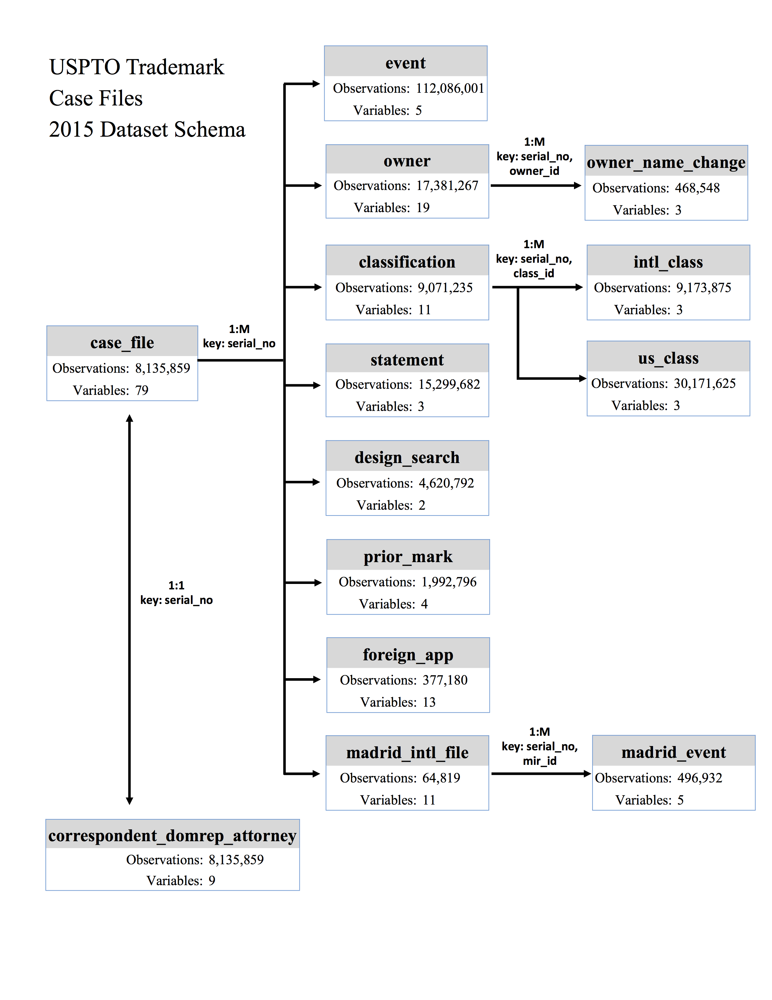

# USPTO - Trademark Parser

This application helps to parse XML files from the USPTO trademark public data that it is available in bulk form. From the XML files this packages generates python dictionaries that can be easily analyze or create CSV files to be work with other analytical tools. USPTO searchable data is viewable through a search interface on the Open Data site.

[https://developer.uspto.gov/product/trademark](https://developer.uspto.gov/product/trademark)

## Installing the package 

**System requirements**

* Python 3

**Python Hard Dependencies**

* xml
* zipfile
* gzip
* bz2

To install the package located source file on your system then run:

`python setup install`

## USPTO Notebook

With this notebook and the uspto package you can parse the XML raw trademark data from the provided by USPTO.

### Loading packages 


```python
import pandas as pd
import uspto as pto
```

### Open USPTO File


```python
# Path to data
path = "data/apc161231-56_sample.xml"
data = pto.openUSPTO(path)
```

### Get XML root

Getting the root might take a couple of minutes depending on size of the XML file and the RAM of your machine.


```python
data = pto.openUSPTO(path)
root = data.getroot()
```

### File Description

With the `pto.getDetails(root)` function we can extract useful information about the XML file also the volume of the trademark applications on the file.


```python
details = pto.getDetails(root)
pd.DataFrame.from_dict(details,orient='index')
```


<div>
<table border="1" class="dataframe">
  <thead>
    <tr style="text-align: right;">
      <th></th>
      <th>0</th>
    </tr>
  </thead>
  <tbody>
    <tr>
      <th>version-no</th>
      <td>2.0</td>
    </tr>
    <tr>
      <th>creation-datetime</th>
      <td>201702250716</td>
    </tr>
    <tr>
      <th>version-date</th>
      <td>20041108</td>
    </tr>
    <tr>
      <th>file-segment</th>
      <td>TRMK</td>
    </tr>
    <tr>
      <th>action-key</th>
      <td>TX</td>
    </tr>
    <tr>
      <th>case-files-vol</th>
      <td>40382</td>
    </tr>
  </tbody>
</table>
</div>


# Extracting and Creating tables

## Case File Header 

Extract the case file header data from the XML file. This function creates a dictionary that can be transform as a table using Pandas.


```python
file_header = pto.getFileHeader(root)
```


```python
table = pd.DataFrame.from_dict(file_header, orient='index')
table.head()
```


<div>
<table border="1" class="dataframe">
  <thead>
    <tr style="text-align: right;">
      <th></th>
      <th>location-date</th>
      <th>use-application-currently-in</th>
      <th>amended-to-itu-application-in</th>
      <th>filing-basis-filed-as-44d-in</th>
      <th>collective-trademark-in</th>
      <th>section-8-accepted-in</th>
      <th>standard-characters-claimed-in</th>
      <th>drawing-3d-filed-in</th>
      <th>foreign-priority-in</th>
      <th>color-drawing-current-in</th>
      <th>...</th>
      <th>filing-date</th>
      <th>attorney-name</th>
      <th>attorney-docket-number</th>
      <th>employee-name</th>
      <th>law-office-assigned-location-code</th>
      <th>published-for-opposition-date</th>
      <th>domestic-representative-name</th>
      <th>abandonment-date</th>
      <th>amend-to-register-date</th>
      <th>registration-date</th>
    </tr>
  </thead>
  <tbody>
    <tr>
      <th>87252004</th>
      <td>20161205</td>
      <td>T</td>
      <td>F</td>
      <td>F</td>
      <td>F</td>
      <td>F</td>
      <td>F</td>
      <td>F</td>
      <td>F</td>
      <td>T</td>
      <td>...</td>
      <td>20161130</td>
      <td>NaN</td>
      <td>NaN</td>
      <td>NaN</td>
      <td>NaN</td>
      <td>NaN</td>
      <td>NaN</td>
      <td>NaN</td>
      <td>NaN</td>
      <td>NaN</td>
    </tr>
    <tr>
      <th>87252005</th>
      <td>20161205</td>
      <td>F</td>
      <td>F</td>
      <td>F</td>
      <td>F</td>
      <td>F</td>
      <td>F</td>
      <td>F</td>
      <td>F</td>
      <td>F</td>
      <td>...</td>
      <td>20161130</td>
      <td>Julie A. Hopkins</td>
      <td>100859.1.7</td>
      <td>NaN</td>
      <td>NaN</td>
      <td>NaN</td>
      <td>Julie A. Hopkins</td>
      <td>NaN</td>
      <td>NaN</td>
      <td>NaN</td>
    </tr>
    <tr>
      <th>87252006</th>
      <td>20161205</td>
      <td>F</td>
      <td>F</td>
      <td>F</td>
      <td>F</td>
      <td>F</td>
      <td>T</td>
      <td>F</td>
      <td>F</td>
      <td>F</td>
      <td>...</td>
      <td>20161130</td>
      <td>Paul R. Fransway</td>
      <td>73285-2</td>
      <td>NaN</td>
      <td>NaN</td>
      <td>NaN</td>
      <td>Paul R. Fransway</td>
      <td>NaN</td>
      <td>NaN</td>
      <td>NaN</td>
    </tr>
    <tr>
      <th>87252007</th>
      <td>20161205</td>
      <td>T</td>
      <td>F</td>
      <td>F</td>
      <td>F</td>
      <td>F</td>
      <td>F</td>
      <td>F</td>
      <td>F</td>
      <td>T</td>
      <td>...</td>
      <td>20161130</td>
      <td>Christopher J. Woods</td>
      <td>1010933</td>
      <td>NaN</td>
      <td>NaN</td>
      <td>NaN</td>
      <td>Christopher J. Woods</td>
      <td>NaN</td>
      <td>NaN</td>
      <td>NaN</td>
    </tr>
    <tr>
      <th>87252008</th>
      <td>20161205</td>
      <td>F</td>
      <td>F</td>
      <td>F</td>
      <td>F</td>
      <td>F</td>
      <td>F</td>
      <td>F</td>
      <td>F</td>
      <td>F</td>
      <td>...</td>
      <td>20161130</td>
      <td>Julie A. Hopkins</td>
      <td>100859.1.7</td>
      <td>NaN</td>
      <td>NaN</td>
      <td>NaN</td>
      <td>Julie A. Hopkins</td>
      <td>NaN</td>
      <td>NaN</td>
      <td>NaN</td>
    </tr>
  </tbody>
</table>
<p>5 rows × 64 columns</p>
</div>


```python
table.to_csv("casefileHeader.csv")
```

## Case File Classification

Extract the case file classification data from the XML file. This function creates a dictionary that can be transform as a table using Pandas.


```python
classifications = pto.getClassifications(root)
```


```python
data = []
for k in classifications.keys():
    for d in classifications[k]:
        data.append(classifications[k][d])
```


```python
table = pd.DataFrame(data)
table.head()
```


<div>
<table border="1" class="dataframe">
  <thead>
    <tr style="text-align: right;">
      <th></th>
      <th>first-use-anywhere-date</th>
      <th>first-use-in-commerce-date</th>
      <th>international-code</th>
      <th>international-code-total-no</th>
      <th>primary-code</th>
      <th>serial-number</th>
      <th>status-code</th>
      <th>status-date</th>
      <th>us-code</th>
      <th>us-code-total-no</th>
    </tr>
  </thead>
  <tbody>
    <tr>
      <th>0</th>
      <td>0</td>
      <td>0</td>
      <td>042</td>
      <td>1</td>
      <td>042</td>
      <td>87326720</td>
      <td>6</td>
      <td>20170210</td>
      <td>100,101</td>
      <td>2</td>
    </tr>
    <tr>
      <th>1</th>
      <td>0</td>
      <td>0</td>
      <td>025</td>
      <td>1</td>
      <td>025</td>
      <td>87331869</td>
      <td>6</td>
      <td>20170216</td>
      <td>022,039</td>
      <td>2</td>
    </tr>
    <tr>
      <th>2</th>
      <td>0</td>
      <td>0</td>
      <td>009</td>
      <td>1</td>
      <td>009</td>
      <td>87326722</td>
      <td>6</td>
      <td>20170210</td>
      <td>021,023,026,036,038</td>
      <td>5</td>
    </tr>
    <tr>
      <th>3</th>
      <td>0</td>
      <td>0</td>
      <td>016</td>
      <td>1</td>
      <td>016</td>
      <td>87326722</td>
      <td>6</td>
      <td>20170210</td>
      <td>002,005,022,023,029,037,038,050</td>
      <td>8</td>
    </tr>
    <tr>
      <th>4</th>
      <td>0</td>
      <td>0</td>
      <td>036</td>
      <td>1</td>
      <td>036</td>
      <td>87326722</td>
      <td>6</td>
      <td>20170210</td>
      <td>100,101,102</td>
      <td>3</td>
    </tr>
  </tbody>
</table>
</div>


```python
table.to_csv("classifications.csv")
```

## Case File Classification Codes

Extract the case file classification codes from the XML file, this table can also be obtanied from the classification table. This function creates a dictionary that can be transform as a table using Pandas.


```python
classification_codes = pto.getClassificationCodes(root)
```


```python
data = []
for k in classification_codes.keys():
    for d in classification_codes[k]:
        data.append(classification_codes[k][d])
```


```python
table = pd.DataFrame(data)
table.head()
```


<div>
<table border="1" class="dataframe">
  <thead>
    <tr style="text-align: right;">
      <th></th>
      <th>international-code</th>
      <th>serial-number</th>
      <th>us-code</th>
    </tr>
  </thead>
  <tbody>
    <tr>
      <th>0</th>
      <td>042</td>
      <td>87326720</td>
      <td>100,101</td>
    </tr>
    <tr>
      <th>1</th>
      <td>025</td>
      <td>87331869</td>
      <td>022,039</td>
    </tr>
    <tr>
      <th>2</th>
      <td>009</td>
      <td>87326722</td>
      <td>021,023,026,036,038</td>
    </tr>
    <tr>
      <th>3</th>
      <td>016</td>
      <td>87326722</td>
      <td>002,005,022,023,029,037,038,050</td>
    </tr>
    <tr>
      <th>4</th>
      <td>036</td>
      <td>87326722</td>
      <td>100,101,102</td>
    </tr>
  </tbody>
</table>
</div>


```python
table.to_csv("classification_codes.csv")
```

## Case File Design Search

Extract the case file Design Search data from the XML file. This function creates a dictionary that can be transform as a table using Pandas.


```python
design = pto.getDesignSearch(root)
```


```python
data = []
for k in design.keys():
    for d in design[k]:
        data.append(design[k][d])
```


```python
table = pd.DataFrame(data)
table.head()
```


<div>
<table border="1" class="dataframe">
  <thead>
    <tr style="text-align: right;">
      <th></th>
      <th>code</th>
      <th>serial-number</th>
    </tr>
  </thead>
  <tbody>
    <tr>
      <th>0</th>
      <td>031519</td>
      <td>87326722</td>
    </tr>
    <tr>
      <th>1</th>
      <td>031524</td>
      <td>87326722</td>
    </tr>
    <tr>
      <th>2</th>
      <td>031525</td>
      <td>87326722</td>
    </tr>
    <tr>
      <th>3</th>
      <td>260121</td>
      <td>87326722</td>
    </tr>
    <tr>
      <th>4</th>
      <td>021108</td>
      <td>87277572</td>
    </tr>
  </tbody>
</table>
</div>


```python
table.to_csv("designSearch.csv")
```

## Case File Owners

Extract the case file owners data from the XML file. This function creates a dictionary that can be transform as a table using Pandas.


```python
owners = pto.getFileOwners(root)
```


```python
data = []
for k in owners.keys():
    for d in owners[k]:
        data.append(owners[k][d])
```


```python
table = pd.DataFrame(data)
table.head()
```


<div>
<table border="1" class="dataframe">
  <thead>
    <tr style="text-align: right;">
      <th></th>
      <th>address-1</th>
      <th>address-2</th>
      <th>city</th>
      <th>composed-of-statement</th>
      <th>country</th>
      <th>dba-aka-text</th>
      <th>entity-statement</th>
      <th>entry-number</th>
      <th>legal-entity-type-code</th>
      <th>nationality</th>
      <th>other</th>
      <th>party-name</th>
      <th>party-type</th>
      <th>postcode</th>
      <th>serial-number</th>
      <th>state</th>
    </tr>
  </thead>
  <tbody>
    <tr>
      <th>0</th>
      <td>637 W 58th St</td>
      <td>NaN</td>
      <td>Kansas City</td>
      <td>NaN</td>
      <td>NaN</td>
      <td>NaN</td>
      <td>NaN</td>
      <td>1</td>
      <td>16</td>
      <td>{'state': 'MO'}</td>
      <td>NaN</td>
      <td>MSMJ</td>
      <td>10</td>
      <td>64113</td>
      <td>87326720</td>
      <td>MO</td>
    </tr>
    <tr>
      <th>1</th>
      <td>12243 Washington Ave</td>
      <td>NaN</td>
      <td>Blue Island</td>
      <td>NaN</td>
      <td>NaN</td>
      <td>NaN</td>
      <td>NaN</td>
      <td>1</td>
      <td>01</td>
      <td>{'country': 'US'}</td>
      <td>NaN</td>
      <td>Greg English</td>
      <td>10</td>
      <td>60406</td>
      <td>87331869</td>
      <td>IL</td>
    </tr>
    <tr>
      <th>2</th>
      <td>5100 South I-35 Service Rd</td>
      <td>NaN</td>
      <td>Oklahoma City</td>
      <td>NaN</td>
      <td>NaN</td>
      <td>NaN</td>
      <td>chartered bank</td>
      <td>1</td>
      <td>99</td>
      <td>{'state': 'OK'}</td>
      <td>NaN</td>
      <td>Frontier State Bank</td>
      <td>10</td>
      <td>73129</td>
      <td>87326722</td>
      <td>OK</td>
    </tr>
    <tr>
      <th>3</th>
      <td>P.O. Box 943</td>
      <td>1621 East Electric Avenue</td>
      <td>McAlester</td>
      <td>NaN</td>
      <td>NaN</td>
      <td>NaN</td>
      <td>NaN</td>
      <td>1</td>
      <td>03</td>
      <td>{'state': 'OK'}</td>
      <td>NaN</td>
      <td>Big V Feeds, Inc.</td>
      <td>10</td>
      <td>74502</td>
      <td>87326723</td>
      <td>OK</td>
    </tr>
    <tr>
      <th>4</th>
      <td>6900 Interbay Blvd</td>
      <td>NaN</td>
      <td>Tampa</td>
      <td>NaN</td>
      <td>NaN</td>
      <td>NaN</td>
      <td>NaN</td>
      <td>1</td>
      <td>16</td>
      <td>{'state': 'FL'}</td>
      <td>NaN</td>
      <td>LJ Avalon LLC</td>
      <td>10</td>
      <td>33616</td>
      <td>87320958</td>
      <td>FL</td>
    </tr>
  </tbody>
</table>
</div>


```python
table.to_csv("fileOwners.csv")
```

## Case File Statements

Extract the case file statements data from the XML file. This function creates a dictionary that can be transform as a table using Pandas.


```python
statements = pto.getFileStatements(root)
```


```python
data = []
for k in statements.keys():
    for d in statements[k]:
        data.append(statements[k][d])
```


```python
table = pd.DataFrame(data)
table.head()
```


<div>
<table border="1" class="dataframe">
  <thead>
    <tr style="text-align: right;">
      <th></th>
      <th>serial-number</th>
      <th>text</th>
      <th>type-code</th>
    </tr>
  </thead>
  <tbody>
    <tr>
      <th>0</th>
      <td>87326720</td>
      <td>Inspecting buildings for the existence of mold</td>
      <td>GS0421</td>
    </tr>
    <tr>
      <th>1</th>
      <td>87331869</td>
      <td>Athletic apparel, namely, headwear; headwear</td>
      <td>GS0251</td>
    </tr>
    <tr>
      <th>2</th>
      <td>87331869</td>
      <td>MASTER KICK MAN</td>
      <td>PM0001</td>
    </tr>
    <tr>
      <th>3</th>
      <td>87326722</td>
      <td>The color(s) blue, white, and grey is/are clai...</td>
      <td>CC0000</td>
    </tr>
    <tr>
      <th>4</th>
      <td>87326722</td>
      <td>The mark consists of a white soaring eagle wit...</td>
      <td>DM0000</td>
    </tr>
  </tbody>
</table>
</div>


```python
table.to_csv("fileStatements.csv")
```

## Case File Foreign Applications

Extract the case file Foreign Applications data from the XML file. This function creates a dictionary that can be transform as a table using Pandas.


```python
foreign = pto.getForeignApplications(root)
```


```python
data = []
for k in foreign.keys():
    for d in foreign[k]:
        data.append(foreign[k][d])
```


```python
table = pd.DataFrame(data)
table.head()
```


<div>
<table border="1" class="dataframe">
  <thead>
    <tr style="text-align: right;">
      <th></th>
      <th>application-number</th>
      <th>country</th>
      <th>entry-number</th>
      <th>filing-date</th>
      <th>foreign-priority-claim-in</th>
      <th>other</th>
      <th>registration-date</th>
      <th>registration-expiration-date</th>
      <th>registration-number</th>
      <th>registration-renewal-date</th>
      <th>serial-number</th>
    </tr>
  </thead>
  <tbody>
    <tr>
      <th>0</th>
      <td>569192</td>
      <td>PT</td>
      <td>1</td>
      <td>20160812</td>
      <td>T</td>
      <td>NaN</td>
      <td>NaN</td>
      <td>NaN</td>
      <td>NaN</td>
      <td>NaN</td>
      <td>87330826</td>
    </tr>
    <tr>
      <th>1</th>
      <td>015719925</td>
      <td>EM</td>
      <td>1</td>
      <td>20160803</td>
      <td>T</td>
      <td>NaN</td>
      <td>NaN</td>
      <td>NaN</td>
      <td>NaN</td>
      <td>NaN</td>
      <td>87322637</td>
    </tr>
    <tr>
      <th>2</th>
      <td>302016033472</td>
      <td>DE</td>
      <td>1</td>
      <td>20161124</td>
      <td>T</td>
      <td>NaN</td>
      <td>NaN</td>
      <td>NaN</td>
      <td>NaN</td>
      <td>NaN</td>
      <td>87322641</td>
    </tr>
    <tr>
      <th>3</th>
      <td>016181281</td>
      <td>EU</td>
      <td>1</td>
      <td>20161219</td>
      <td>T</td>
      <td>NaN</td>
      <td>NaN</td>
      <td>NaN</td>
      <td>NaN</td>
      <td>NaN</td>
      <td>87273490</td>
    </tr>
    <tr>
      <th>4</th>
      <td>1777139</td>
      <td>AU</td>
      <td>1</td>
      <td>20160616</td>
      <td>T</td>
      <td>NaN</td>
      <td>NaN</td>
      <td>NaN</td>
      <td>NaN</td>
      <td>NaN</td>
      <td>87262553</td>
    </tr>
  </tbody>
</table>
</div>


```python
table.to_csv("foreignApplications.csv")
```

## Case File Prior Applications

Extract the case file Prior Applications data from the XML file. This function creates a dictionary that can be transform as a table using Pandas.


```python
prior = pto.getPriorApplications(root)
```


```python
data = []
for k in prior.keys():
    for d in prior[k]:
        data.append(prior[k][d])
```


```python
table = pd.DataFrame(data)
table.head()
```


<div>
<table border="1" class="dataframe">
  <thead>
    <tr style="text-align: right;">
      <th></th>
      <th>number</th>
      <th>other-related-in</th>
      <th>prior-registration-application</th>
      <th>relationship-type</th>
      <th>serial-number</th>
    </tr>
  </thead>
  <tbody>
    <tr>
      <th>0</th>
      <td>3487431</td>
      <td>F</td>
      <td>2</td>
      <td>0</td>
      <td>87261195</td>
    </tr>
    <tr>
      <th>1</th>
      <td>4739670</td>
      <td>F</td>
      <td>2</td>
      <td>0</td>
      <td>87261195</td>
    </tr>
    <tr>
      <th>2</th>
      <td>1186117</td>
      <td>F</td>
      <td>3</td>
      <td>0</td>
      <td>87273474</td>
    </tr>
    <tr>
      <th>3</th>
      <td>3053476</td>
      <td>F</td>
      <td>3</td>
      <td>0</td>
      <td>87273474</td>
    </tr>
    <tr>
      <th>4</th>
      <td>4447492</td>
      <td>F</td>
      <td>3</td>
      <td>0</td>
      <td>87273474</td>
    </tr>
  </tbody>
</table>
</div>


```python
table.to_csv("priorApplications.csv")
```

## Case File Events

Extract the case file events data from the XML file. This function creates a dictionary that can be transform as a table using Pandas.


```python
events = pto.getFileEvent(root)
```


```python
data = []
for k in events.keys():
    for d in events[k]:
        data.append(events[k][d])
```


```python
table = pd.DataFrame(data)
table.head()
```


<div>
<table border="1" class="dataframe">
  <thead>
    <tr style="text-align: right;">
      <th></th>
      <th>code</th>
      <th>date</th>
      <th>description-text</th>
      <th>number</th>
      <th>serial-number</th>
      <th>type</th>
    </tr>
  </thead>
  <tbody>
    <tr>
      <th>0</th>
      <td>NWOS</td>
      <td>20170210</td>
      <td>NEW APPLICATION OFFICE SUPPLIED DATA ENTERED I...</td>
      <td>2</td>
      <td>87326720</td>
      <td>I</td>
    </tr>
    <tr>
      <th>1</th>
      <td>NWAP</td>
      <td>20170210</td>
      <td>NEW APPLICATION ENTERED IN TRAM</td>
      <td>1</td>
      <td>87326720</td>
      <td>I</td>
    </tr>
    <tr>
      <th>2</th>
      <td>MPMK</td>
      <td>20170217</td>
      <td>NOTICE OF PSEUDO MARK E-MAILED</td>
      <td>3</td>
      <td>87331869</td>
      <td>E</td>
    </tr>
    <tr>
      <th>3</th>
      <td>NWOS</td>
      <td>20170216</td>
      <td>NEW APPLICATION OFFICE SUPPLIED DATA ENTERED I...</td>
      <td>2</td>
      <td>87331869</td>
      <td>I</td>
    </tr>
    <tr>
      <th>4</th>
      <td>NWAP</td>
      <td>20170214</td>
      <td>NEW APPLICATION ENTERED IN TRAM</td>
      <td>1</td>
      <td>87331869</td>
      <td>I</td>
    </tr>
  </tbody>
</table>
</div>


```python
table.to_csv("fileEvent.csv")
```

## Case File Correspondent

Extract the case file correspondent data from the XML file. This function creates a dictionary that can be transform as a table using Pandas.


```python
correspondent = pto.getCorrespondent(root)
```


```python
data = []
for k in correspondent.keys():
        data.append(correspondent[k])
```


```python
table = pd.DataFrame(data)
table.head()
```


<div>
<table border="1" class="dataframe">
  <thead>
    <tr style="text-align: right;">
      <th></th>
      <th>address-1</th>
      <th>address-2</th>
      <th>address-3</th>
      <th>address-4</th>
      <th>address-5</th>
      <th>serial-number</th>
    </tr>
  </thead>
  <tbody>
    <tr>
      <th>0</th>
      <td>MSMJ</td>
      <td>637 W 58TH ST</td>
      <td>KANSAS CITY, MO 64113</td>
      <td>NaN</td>
      <td>NaN</td>
      <td>87326720</td>
    </tr>
    <tr>
      <th>1</th>
      <td>KELLY A. DONAHUE</td>
      <td>VERRILL DANA, LLP</td>
      <td>ONE PORTLAND SQUARE</td>
      <td>PORTLAND, ME 04112-0586</td>
      <td>NaN</td>
      <td>87325322</td>
    </tr>
    <tr>
      <th>2</th>
      <td>BARBOSA, JAIME</td>
      <td>15921 SW 61 STREET</td>
      <td>DAVIE, FL 33331</td>
      <td>NaN</td>
      <td>NaN</td>
      <td>87326721</td>
    </tr>
    <tr>
      <th>3</th>
      <td>SCOTT NYMAN</td>
      <td>NYMAN IP LLC</td>
      <td>20 NORTH WACKER DRIVE, SUITE 1200</td>
      <td>CHICAGO, IL 60606</td>
      <td>NaN</td>
      <td>87331869</td>
    </tr>
    <tr>
      <th>4</th>
      <td>JASON GOLDSMITH</td>
      <td>GOLDSMITH ASSOCIATES, PLLC</td>
      <td>P.O. BOX 140091</td>
      <td>P.O. BOX 140091</td>
      <td>DALLAS, TX 75214</td>
      <td>87326722</td>
    </tr>
  </tbody>
</table>
</div>


```python
table.to_csv("correspondent.csv")
```

## Case File Madrid Filing

Extract the case file Madrid Filing data from the XML file. This function creates a dictionary that can be transform as a table using Pandas.


```python
madrid_filing = pto.getMadridFiling(root)
```


```python
data = []
for k in madrid_filing.keys():
    data.append(madrid_filing[k])
```


```python
table = pd.DataFrame(data)
table.head()
```


<div>
<table border="1" class="dataframe">
  <thead>
    <tr style="text-align: right;">
      <th></th>
      <th>entry-number</th>
      <th>international-registration-date</th>
      <th>international-registration-number</th>
      <th>international-renewal-date</th>
      <th>international-status-code</th>
      <th>international-status-date</th>
      <th>irregularity-reply-by-date</th>
      <th>madrid-history-events</th>
      <th>original-filing-date-uspto</th>
      <th>reference-number</th>
      <th>serial-number</th>
    </tr>
  </thead>
  <tbody>
    <tr>
      <th>0</th>
      <td>1</td>
      <td>NaN</td>
      <td>NaN</td>
      <td>NaN</td>
      <td>403</td>
      <td>20170213</td>
      <td>NaN</td>
      <td>3</td>
      <td>20170210</td>
      <td>A0064942</td>
      <td>87322369</td>
    </tr>
    <tr>
      <th>1</th>
      <td>1</td>
      <td>NaN</td>
      <td>NaN</td>
      <td>NaN</td>
      <td>403</td>
      <td>20170214</td>
      <td>NaN</td>
      <td>3</td>
      <td>20170213</td>
      <td>A0064960</td>
      <td>87328683</td>
    </tr>
    <tr>
      <th>2</th>
      <td>1</td>
      <td>NaN</td>
      <td>NaN</td>
      <td>NaN</td>
      <td>403</td>
      <td>20170213</td>
      <td>NaN</td>
      <td>3</td>
      <td>20170210</td>
      <td>A0064942</td>
      <td>87322372</td>
    </tr>
    <tr>
      <th>3</th>
      <td>1</td>
      <td>NaN</td>
      <td>NaN</td>
      <td>NaN</td>
      <td>403</td>
      <td>20170216</td>
      <td>NaN</td>
      <td>3</td>
      <td>20170214</td>
      <td>A0064995</td>
      <td>87330276</td>
    </tr>
    <tr>
      <th>4</th>
      <td>1</td>
      <td>NaN</td>
      <td>NaN</td>
      <td>NaN</td>
      <td>403</td>
      <td>20170213</td>
      <td>NaN</td>
      <td>3</td>
      <td>20170210</td>
      <td>A0064942</td>
      <td>87322374</td>
    </tr>
  </tbody>
</table>
</div>


```python
table.to_csv("madridFiling.csv")
```

## Case File Madrid Events

Extract the case file Madrid Events data from the XML file. This function creates a dictionary that can be transform as a table using Pandas.


```python
madrid_events = pto.getMadridEvents(root)
```


```python
data = []
for k in madrid_events.keys():
    for d in madrid_events[k]:
        data.append(madrid_events[k][d])
```


```python
table = pd.DataFrame(data)
table.head()
```


<div>
<table border="1" class="dataframe">
  <thead>
    <tr style="text-align: right;">
      <th></th>
      <th>code</th>
      <th>date</th>
      <th>description-text</th>
      <th>entry-number</th>
      <th>serial-number</th>
    </tr>
  </thead>
  <tbody>
    <tr>
      <th>0</th>
      <td>NEWAP</td>
      <td>20170210</td>
      <td>NEW APPLICATION FOR IR RECEIVED</td>
      <td>1</td>
      <td>87322369</td>
    </tr>
    <tr>
      <th>1</th>
      <td>MCERT</td>
      <td>20170213</td>
      <td>MANUALLY CERTIFIED</td>
      <td>2</td>
      <td>87322369</td>
    </tr>
    <tr>
      <th>2</th>
      <td>APPST</td>
      <td>20170213</td>
      <td>IR CERTIFIED AND SENT TO IB</td>
      <td>3</td>
      <td>87322369</td>
    </tr>
    <tr>
      <th>3</th>
      <td>NEWAP</td>
      <td>20170213</td>
      <td>NEW APPLICATION FOR IR RECEIVED</td>
      <td>1</td>
      <td>87328683</td>
    </tr>
    <tr>
      <th>4</th>
      <td>MCERT</td>
      <td>20170214</td>
      <td>MANUALLY CERTIFIED</td>
      <td>2</td>
      <td>87328683</td>
    </tr>
  </tbody>
</table>
</div>


```python
table.to_csv("madridEvents.csv")
```

## Tables 
The following table schema diagram from 2015 is a good example of what you can expect to be on the USPTO trademark data.

**case files schema high level 2015**
